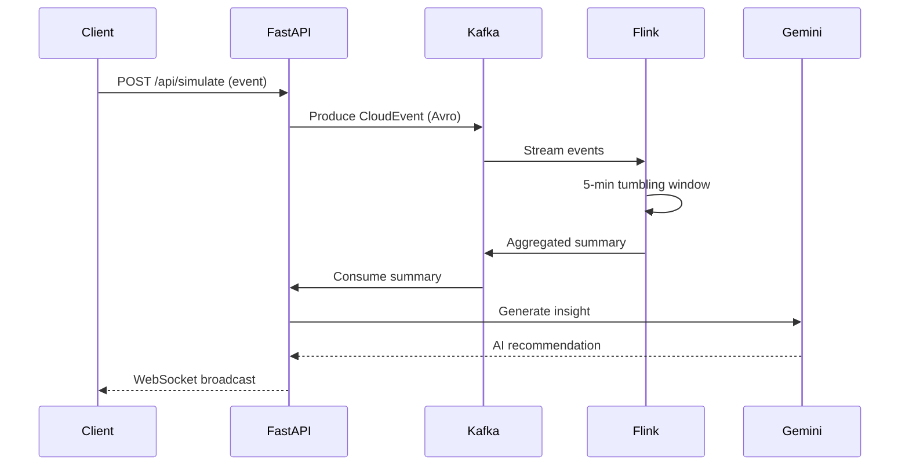

# Architecture Overview

## System Design

OpsVision Backend follows a **modular microservices-friendly architecture** with clear separation of concerns.

## Data Flow



## Components

### API Layer (`app/routes/`)

| Module | Purpose |
|--------|---------|
| `health.py` | Health checks, stats, summary fetching |
| `events.py` | Event simulation, scenario execution |
| `websocket.py` | Real-time client connections |

### Service Layer (`app/services/`)

| Module | Purpose |
|--------|---------|
| `kafka_service.py` | Kafka producer/consumer with Avro |
| `ai_service.py` | Gemini AI integration |
| `websocket_manager.py` | Connection management |

### Configuration (`app/config.py`)

Centralized configuration loaded from environment variables:
- Kafka connection settings
- Schema Registry credentials
- Gemini API key
- Topic names

## Serialization

Events use **CloudEvents spec** with **Avro serialization**:

```json
{
  "specversion": "1.0",
  "type": "com.opsvision.event",
  "source": "https://kubernetes.com/demo",
  "id": "uuid",
  "time": "2025-12-23T18:00:00Z",
  "data": "{\"severity\": \"critical\", ...}"
}
```

## Scaling Considerations

- **Horizontal scaling**: Stateless FastAPI instances behind load balancer
- **Kafka partitioning**: Events partitioned by source for ordering
- **Flink parallelism**: Configurable based on event volume
