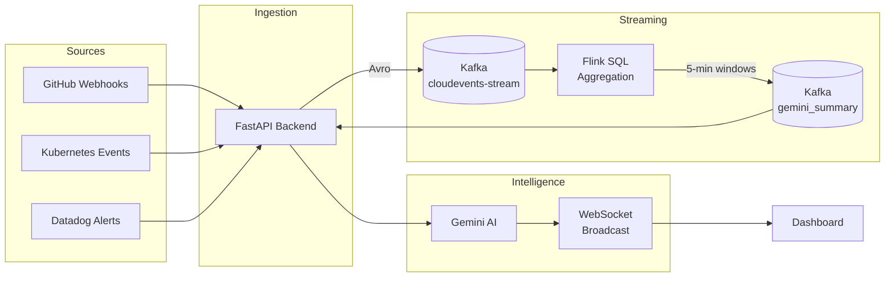

# 🔍 OpsVision Backend

> **AI-Powered Real-Time Event Intelligence Platform**

[](https://python.org)
[](https://fastapi.tiangolo.com)
[](https://confluent.io)
[](https://ai.google.dev)
[](LICENSE)

OpsVision transforms raw system events into actionable intelligence using **Apache Kafka** for real-time streaming, **Apache Flink** for stream processing, and **Google Gemini AI** for intelligent insights.

---

## ✨ Features

| Feature | Description |
|---------|-------------|
| 🚀 **Real-Time Streaming** | CloudEvents ingestion via Kafka with Avro serialization |
| 🤖 **AI-Powered Insights** | Google Gemini generates actionable recommendations |
| 📊 **Live Dashboards** | WebSocket-based real-time updates |
| 🔗 **Event Correlation** | Flink SQL aggregates and correlates events |
| 🎭 **Event Simulation** | Built-in scenario testing for demos |

---

## 🏗️ Architecture



---

## 🚀 Quick Start

### Prerequisites
- Python 3.11+
- Confluent Cloud account (Kafka + Schema Registry)
- Google Gemini API key

### Installation

```bash
# Clone repository
git clone https://github.com/your-username/OpsVisionBackend.git
cd OpsVisionBackend

# Create virtual environment
python -m venv .venv
.venv\Scripts\activate  # Windows
# source .venv/bin/activate  # Linux/Mac

# Install dependencies
pip install -r requirements.txt

# Configure environment
cp .env.example .env
# Edit .env with your credentials
```

### Run

```bash
python main.py
```

Server starts at `http://localhost:8000`

---

## 📡 API Endpoints

| Method | Endpoint | Description |
|--------|----------|-------------|
| `GET` | `/` | Service info |
| `GET` | `/api/stats` | Current statistics |
| `GET` | `/api/templates` | Event templates |
| `GET` | `/api/summaries` | Fetch Kafka summaries |
| `POST` | `/api/simulate` | Simulate events |
| `POST` | `/api/scenario/{name}` | Run predefined scenario |
| `WS` | `/ws` | Real-time WebSocket |

### Example: Simulate an Event

```bash
curl -X POST http://localhost:8000/api/simulate \
  -H "Content-Type: application/json" \
  -d '{"event_type": "error", "source": "api-gateway", "count": 5}'
```

---

## 🧪 Testing

```bash
# Run all tests
pytest tests/ -v

# With coverage
pytest tests/ --cov=app --cov-report=html
```

---

## 📁 Project Structure

```
OpsVisionBackend/
├── app/
│   ├── __init__.py          # FastAPI app initialization
│   ├── config.py             # Configuration & environment
│   ├── models.py             # Pydantic models
│   ├── routes/
│   │   ├── events.py         # Event simulation endpoints
│   │   ├── health.py         # Health & stats endpoints
│   │   └── websocket.py      # WebSocket handler
│   ├── services/
│   │   ├── ai_service.py     # Gemini AI integration
│   │   ├── kafka_service.py  # Kafka producer/consumer
│   │   └── websocket_manager.py
│   └── schemas/
│       └── cloudevent.avsc   # Avro schema
├── tests/                    # Pytest test suite
├── scripts/                  # Utility scripts
├── main.py                   # Entry point
├── requirements.txt
└── .env.example
```

---

## 🛠️ Tech Stack

- **Backend**: FastAPI, Uvicorn
- **Streaming**: Apache Kafka (Confluent Cloud)
- **Processing**: Apache Flink SQL
- **Serialization**: Avro + Schema Registry
- **AI**: Google Gemini 2.0 Flash
- **Real-time**: WebSockets

---

## 🏆 Hackathon

Built for [DevPost Hackathon Name] - Demonstrating real-time event intelligence with modern streaming architecture.

---

## 📄 License

MIT License - see [LICENSE](LICENSE) for details.

---

## 👥 Team

- Your Name - [GitHub](https://github.com/your-username)

---

<p align="center">
  <b>⭐ Star this repo if you find it useful!</b>
</p>
